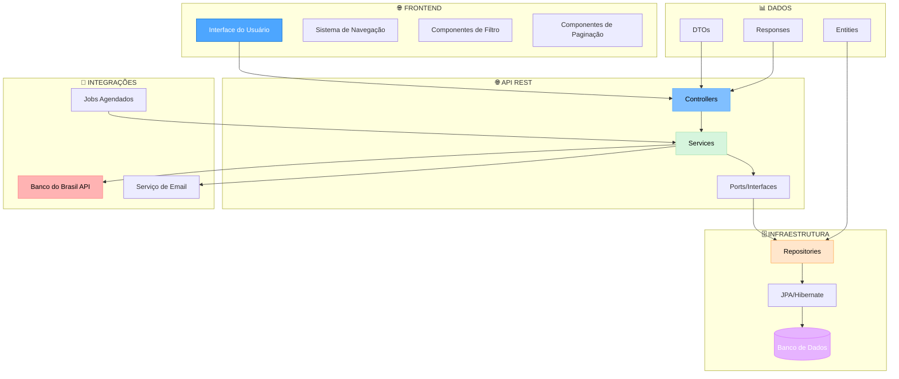
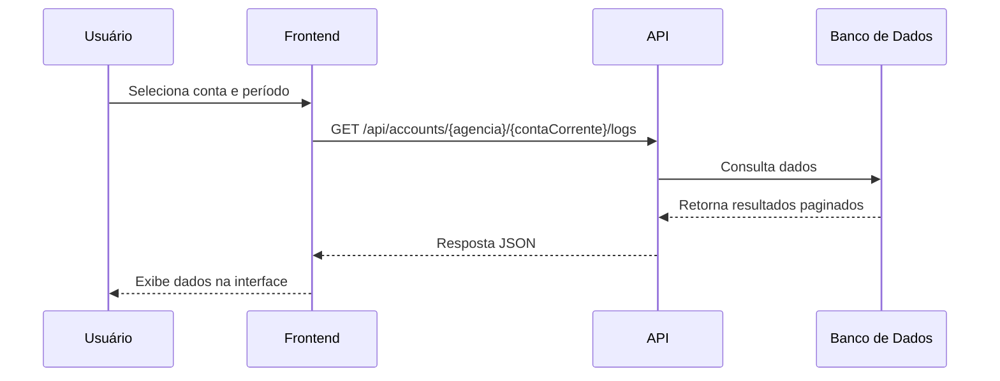
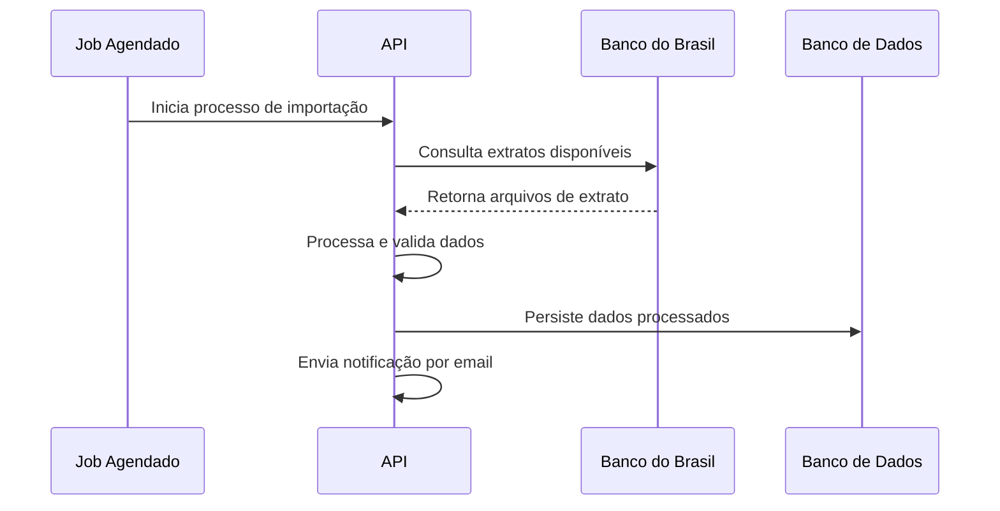

# Visão Geral da Arquitetura do Sistema

## Resumo/Objetivo
Documentação da arquitetura geral do sistema de consulta de extratos bancários, incluindo componentes principais, fluxos de dados e decisões arquiteturais. Este documento fornece uma visão de alto nível para desenvolvedores e arquitetos.

## Contexto
O sistema foi desenvolvido para processar e consultar extratos bancários do Banco do Brasil, permitindo importação de arquivos, processamento de movimentações e consulta de histórico através de uma API REST. A arquitetura segue padrões modernos de desenvolvimento com separação clara de responsabilidades.

## Detalhamento

### Arquitetura Geral

### Componentes Principais

#### 1. Frontend (React + shadcn/ui)
- **Responsabilidade**: Interface do usuário e interação
- **Tecnologias**: React 18+, TypeScript, shadcn/ui, Tailwind CSS
- **Padrões**: Componentes funcionais, hooks customizados, validação com Zod

#### 2. API REST (Kotlin + Spring Boot)
- **Responsabilidade**: Lógica de negócio e exposição de serviços
- **Tecnologias**: Kotlin, Spring Boot, Spring Web
- **Padrões**: Controller-Service-Repository, DTOs, validação de entrada

#### 3. Camada de Dados (JPA + Hibernate)
- **Responsabilidade**: Persistência e acesso aos dados
- **Tecnologias**: JPA, Hibernate, Spring Data
- **Padrões**: Repository Pattern, Entity Mapping, Transações

#### 4. Integrações Externas
- **Banco do Brasil**: API para consulta de extratos
- **Email**: Serviço para notificações
- **Jobs**: Processamento agendado de importações

### Fluxos de Dados Principais

#### 1. Fluxo de Consulta de Dados

#### 2. Fluxo de Importação de Extratos

### Decisões Arquiteturais

#### 1. Separação de Camadas
- **Controller**: Responsável apenas por receber requisições HTTP
- **Service**: Contém toda a lógica de negócio
- **Repository**: Abstrai o acesso aos dados
- **Port**: Define contratos entre camadas

#### 2. Padrão Repository
- **Vantagem**: Facilita testes unitários e mock de dados
- **Implementação**: Interface + implementação concreta
- **Uso**: Injeção de dependência via Spring

#### 3. DTOs para Transferência
- **Request DTOs**: Validação de entrada e mapeamento
- **Response DTOs**: Formatação de saída e paginação
- **Benefício**: Separação entre modelo de domínio e API

#### 4. Paginação Padrão
- **Implementação**: Spring Data Pageable
- **Resposta**: Estrutura consistente para todos os endpoints
- **Benefício**: Performance e usabilidade

### Estrutura de Banco de Dados

#### Tabelas Principais
1. **`importacao`** - Registra importações de extratos
2. **`movimento`** - Armazena movimentações bancárias
3. **`log`** - Histórico de consultas e erros

#### Relacionamentos
- Uma importação pode ter múltiplos movimentos
- Logs são independentes e referenciam contas específicas
- Todas as tabelas incluem campos de auditoria (data/hora)

### Segurança e Validação

#### Validações de Entrada
- **Formato de agência**: 4 dígitos numéricos
- **Formato de conta**: XX.XXX-X
- **Período de consulta**: data início ≤ data fim
- **Paginação**: limites de tamanho de página

#### Tratamento de Erros
- **HTTP Status Codes**: Padrões REST
- **Mensagens de erro**: Estruturadas e informativas
- **Logs**: Rastreamento completo de operações

### Performance e Escalabilidade

#### Estratégias Implementadas
- **Paginação**: Controle de volume de dados retornados
- **Índices de banco**: Otimização de consultas por agência/conta
- **Transações**: Controle de consistência de dados

#### Considerações Futuras
- **Cache**: Para consultas frequentes
- **Compressão**: Para respostas grandes
- **Rate Limiting**: Para controle de uso da API

### Monitoramento e Observabilidade

#### Logs
- **Nível**: INFO para operações normais, ERROR para falhas
- **Contexto**: Agência, conta, período, usuário
- **Rastreamento**: IDs únicos para operações

#### Métricas
- **Performance**: Tempo de resposta dos endpoints
- **Uso**: Volume de consultas por período
- **Erros**: Taxa de falhas e tipos de erro

### Testes

#### Estratégia de Testes
- **Unitários**: Services e lógica de negócio
- **Integração**: Controllers e repositories
- **E2E**: Fluxos completos de consulta

#### Cobertura
- **Objetivo**: Mínimo 80% de cobertura
- **Foco**: Lógica de negócio e validações
- **Mock**: Integrações externas

### Deployment e Infraestrutura

#### Ambientes
- **Desenvolvimento**: Local com banco H2
- **Produção**: Servidor com banco PostgreSQL
- **Configuração**: Via arquivos YAML e variáveis de ambiente

#### Containerização
- **Docker**: Para desenvolvimento e testes
- **Build**: Maven para gerenciamento de dependências
- **Deploy**: JAR executável com Spring Boot

## Referências

- [Documentação da API](api-endpoints.md)
- [Implementação Frontend](frontend-implementation.md)
- [Spring Boot Documentation](https://spring.io/projects/spring-boot)
- [Kotlin Language](https://kotlinlang.org/)
- [JPA Specification](https://jakarta.ee/specifications/persistence/)

## Histórico de Alterações

| Data | Autor | Descrição |
|------|-------|-----------|
| 2024-01-15 | Sistema | Criação inicial da documentação de arquitetura |
| 2024-01-15 | Sistema | Adição de diagramas e fluxos de dados |
| 2024-01-15 | Sistema | Documentação de decisões arquiteturais |
