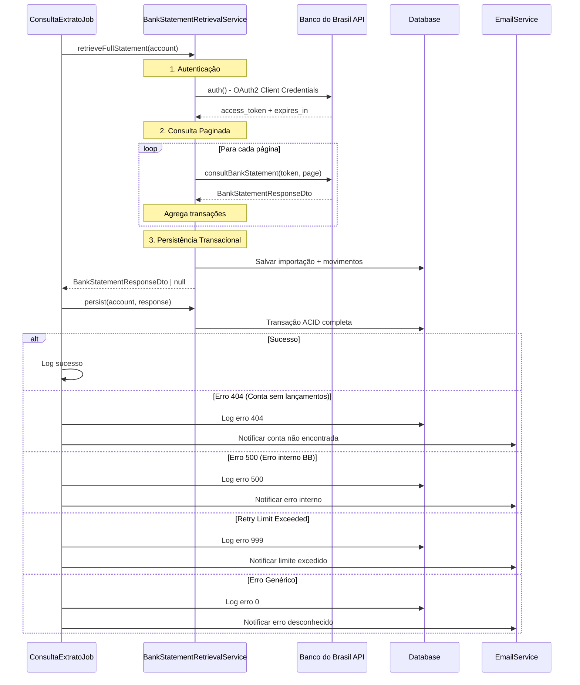
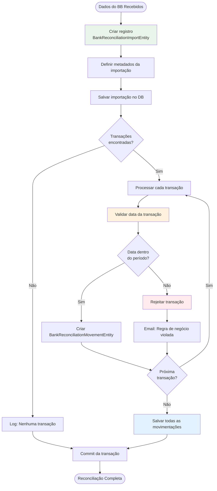

# API BB Extrato - Fluxos de Negócio e Regras

## 📋 Visão Geral

Este documento detalha os **fluxos de negócio** e **regras implementadas** no sistema API BB Extrato. O sistema automatiza a consulta de extratos bancários do Banco do Brasil e a reconciliação dos dados para controle financeiro da UFRJ/Coppetec.

## 🎯 Objetivo do Negócio

**Automatizar completamente** o processo de:
1. **Consulta periódica** de extratos bancários via API oficial do BB
2. **Reconciliação** dos dados financeiros com sistema interno
3. **Auditoria completa** de todas as operações
4. **Notificação automática** de problemas e exceções

## 🔄 Fluxo Principal - Consulta Automatizada

### 📅 Agendamento e Execução

```mermaid
graph TD
    Start([Cron Job Inicia]) --> Lock{Job já em<br>execução?}
    Lock -->|Sim| End1([Finaliza - Evita concorrência])
    Lock -->|Não| SetFlag[isRunning = true]
    
    SetFlag --> GetAccounts[Buscar contas ativas<br>getContaAConsultar()]
    GetAccounts --> CheckAccounts{Contas<br>encontradas?}
    
    CheckAccounts -->|Não| LogNoAccounts[Log: Nenhuma conta ativa]
    CheckAccounts -->|Sim| ProcessLoop[Processar cada conta]
    
    ProcessLoop --> ProcessAccount[Processar Conta Individual]
    ProcessAccount --> MoreAccounts{Mais contas<br>na lista?}
    
    MoreAccounts -->|Sim| ProcessLoop
    MoreAccounts -->|Não| CleanUp[isRunning = false]
    
    LogNoAccounts --> CleanUp
    CleanUp --> End2([Job Finalizado])
    
    style SetFlag fill:#e1f5fe
    style ProcessAccount fill:#fff3e0
    style CleanUp fill:#f3e5f5
```

**Configuração do Agendamento:**
- **Expressão Cron**: Configurável via `schedule.cron` no YAML
- **Controle de Concorrência**: Flag `isRunning` impede execuções simultâneas
- **Logging Detalhado**: Cada etapa é auditada com timestamps

### 🏦 Processamento Individual de Conta



## 💰 Fluxo de Reconciliação Bancária

### 📊 Processo de Importação



### 📋 Metadados da Importação

```kotlin
// Exemplo de registro de importação
BankReconciliationImportEntity(
    layoutId = 2,                    // Layout padrão do sistema
    sourceBank = "001",              // Código do Banco do Brasil
    fileName = "IMPORTED WITH API",  // Identificador da fonte
    fileGeneratedAt = LocalDateTime.now(),
    batchCount = 1,                  // Lote único por importação
    recordCount = transactions.size, // Total de transações
    accountCount = 1,                // Uma conta por importação
    queryAgency = account.branch,    // Agência consultada
    queryAccount = account.currentAccount, // Conta consultada
    queryPeriodFrom = periodStart,   // Início do período
    queryPeriodTo = periodEnd        // Fim do período
)
```

## 🛡️ Regras de Validação e Negócio

### 📅 Validação de Período

**Regra Principal**: Transações só são aceitas se estiverem dentro do período configurado para a conta.

```kotlin
fun isTransactionDateBeforeOrEqualTo(
    transactionDate: LocalDateTime, 
    databaseDate: LocalDateTime
): Boolean {
    return transactionDate.toLocalDate().isBefore(databaseDate.toLocalDate()) ||
           transactionDate.toLocalDate().isEqual(databaseDate.toLocalDate())
}
```

**Consequências da Violação**:
- Transação é **rejeitada** e não persistida
- Email de notificação é enviado para a equipe
- Log de auditoria é registrado com detalhes

### 🏦 Validação de Conta

**Regras de Conta**:
- Conta deve estar **ativa** no sistema
- Agência e conta devem ter formato válido
- Período de consulta deve estar configurado

**Validações Automáticas**:
```kotlin
// Validação de formato de agência (ex: 2234-9)
fun validateAgencyFormat(agency: String): Boolean {
    return agency.matches(Regex("\\d{4}-\\d"))
}

// Validação de formato de conta (ex: 57446-5)
fun validateAccountFormat(account: String): Boolean {
    return account.matches(Regex("\\d{5}-\\d"))
}
```

## 🔄 Padrões de Tratamento de Erros

### 📊 Categorização de Erros

| Código | Tipo | Descrição | Ação |
|--------|------|-----------|------|
| 0 | Genérico | Erro desconhecido | Email + Log |
| 404 | Not Found | Conta não encontrada | Email + Log |
| 500 | Internal Error | Erro interno BB | Email + Log |
| 999 | Retry Limit | Limite de tentativas | Email + Log |

### 🚨 Notificações Automáticas

**Template de Email para Regras Violadas**:
```kotlin
val message = """
    Regra de negócio violada para a conta:
    Agência: ${account.branch}
    Conta: ${account.currentAccount}
    
    Transação: ${transactionDate}
    Período Configurado: ${databaseDate}
    
    A transação foi rejeitada automaticamente.
""".trimIndent()
```

**Template de Email para Erros de Persistência**:
```kotlin
val message = """
    Erro durante persistência para:
    Agência: ${account.branch}
    Conta: ${account.currentAccount}
    
    Erro: ${errorMessage}
    Timestamp: ${LocalDateTime.now()}
    
    Verificar logs do sistema.
""".trimIndent()
```

## 📈 Monitoramento e Métricas

### 🎯 Métricas de Performance

**Tempo de Execução**:
- **Máximo Aceitável**: 1 segundo para workflow completo
- **Variação Máxima**: 100ms entre execuções consecutivas
- **Throughput Mínimo**: 5 requisições por segundo

**Métricas de Job**:
```kotlin
data class JobProgressSummaryResponse(
    val activeJobs: Int,           // Jobs em execução
    val completedJobs: Int,        // Jobs concluídos
    val failedJobs: Int,           // Jobs falharam
    val cancelledJobs: Int,        // Jobs cancelados
    val averageExecutionTime: Double, // Tempo médio de execução
    val successRate: Double,       // Taxa de sucesso (%)
    val totalRecordsProcessed: Long, // Total de registros processados
    val totalAccountsProcessed: Int  // Total de contas processadas
)
```

### 📊 Logs de Auditoria

**Estrutura do Log**:
```kotlin
ConsultaContaCorrenteExtratoLogEntity(
    agencia = account.branch,
    contaCorrente = account.currentAccount,
    dataInicio = account.queryPeriodFrom,
    dataFim = account.queryPeriodTo,
    status = executionStatus,
    mensagem = detailedMessage,
    timestamp = LocalDateTime.now()
)
```

**Níveis de Log**:
- **INFO**: Operações normais e sucessos
- **WARN**: Situações que merecem atenção
- **ERROR**: Erros que impedem execução
- **DEBUG**: Detalhes para troubleshooting

## 🔧 Padrões Técnicos Implementados

### 🏗️ Arquitetura de Camadas

**1. Domain Layer (Regras de Negócio)**:
- Entidades puras sem dependências externas
- Validações de regras de negócio
- Exceptions específicas do domínio

**2. Application Layer (Casos de Uso)**:
- Services que orquestram operações
- Ports que definem contratos
- DTOs para transferência de dados

**3. Infrastructure Layer (Adaptadores)**:
- Implementações de repositórios
- Clientes HTTP para APIs externas
- Jobs agendados e configurações

### 🔄 Padrões de Design

**1. Repository Pattern**:
```kotlin
interface AccountPort {
    fun getAllActiveAccounts(): List<Account>
    fun save(account: Account): Account
}
```

**2. Template Method Pattern**:
```kotlin
// Processamento padronizado de contas
private fun processarContas(jobName: String) {
    val accounts = accountPort.getAllActiveAccounts()
    accounts.forEachIndexed { index, account ->
        processarContaIndividual(account, index, accounts.size, jobName)
    }
}
```

**3. Observer Pattern**:
```kotlin
// Notificações automáticas em eventos
emailService.send(
    account = account,
    message = message,
    error = error
)
```

**4. Retry Pattern**:
```kotlin
// Configuração de retry via Resilience4j
@Retry(name = "bb-api-retry")
@CircuitBreaker(name = "bb-api-circuit-breaker")
fun consultBankStatement(request: BankStatementRequest): BankStatementResponseDto
```

## 🚀 Otimizações de Performance

### 📊 Processamento em Lote

**Bulk Operations**:
```kotlin
// Salvamento em lote de movimentações
bankReconciliationMovementPort.saveAll(movements)
```

**Transações Otimizadas**:
```kotlin
@Transactional(rollbackOn = [Exception::class])
fun persist(account: Account, response: BankStatementResponseDto?) {
    // Toda operação em uma única transação
    // Rollback automático em caso de erro
}
```

### 🔄 Paginação Inteligente

**Consulta Paginada**:
```kotlin
var currentPage = 0
do {
    val response = bbPort.consultBankStatement(request.copy(pageNumber = currentPage.toString()))
    bankStatement.transactions.addAll(response.transactions)
    currentPage = response.nextPageNumber
} while (currentPage != 0)
```

**Agregação de Resultados**:
- Transações são agregadas em memória
- Uma única transação de banco para persistência
- Redução de overhead de rede e banco

## 📋 Configurações e Propriedades

### ⚙️ Configurações de Agendamento

```yaml
schedule:
  cron: "0 0 6 * * ?"  # 6h da manhã, todos os dias
  max-concurrent-jobs: 1
  retry-attempts: 3
  retry-delay: 5000ms
```

### 🔐 Configurações de Segurança

**OAuth2 Client Credentials**:
```yaml
bb:
  api:
    client-id: ${BB_CLIENT_ID}
    client-secret: ${BB_CLIENT_SECRET}
    scope: "extrato.read"
    token-url: "https://oauth.bb.com.br/oauth/token"
```

**SSL/TLS**:
```yaml
feign:
  client:
    config:
      default:
        connectTimeout: 5000
        readTimeout: 10000
        loggerLevel: BASIC
```

## 🎯 Próximos Passos e Melhorias

### 📊 Métricas Avançadas

**Implementar**:
- Dashboard de métricas em tempo real
- Alertas automáticos para falhas
- Histórico de performance por período

### 🔄 Resiliência

**Melhorar**:
- Circuit breaker mais sofisticado
- Fallback strategies para APIs externas
- Dead letter queue para mensagens falhadas

### 📈 Escalabilidade

**Considerar**:
- Processamento paralelo de contas
- Cache distribuído para tokens
- Load balancing para múltiplas instâncias

---

**Documento Atualizado**: ${LocalDateTime.now().format(DateTimeFormatter.ofPattern("dd/MM/yyyy HH:mm:ss"))}
**Versão**: 2.0 - Padrões Técnicos e Fluxos Completos
