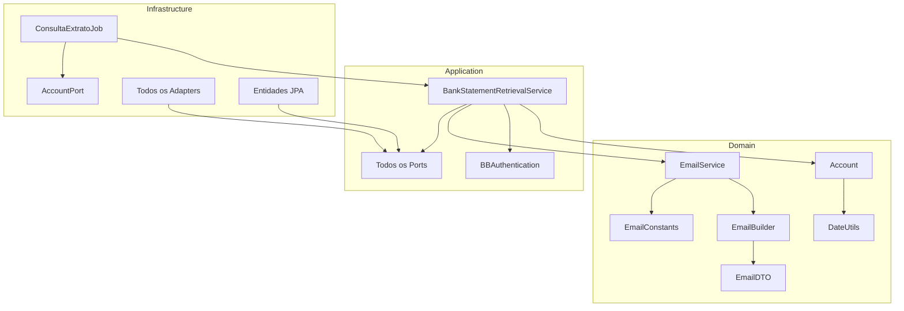

# API BB Extrato - Referência Completa de Componentes

## 📋 Visão Geral

Este documento apresenta uma análise detalhada de todos os componentes do sistema API BB Extrato, organizados por camada da Clean Architecture. Cada componente é documentado com sua responsabilidade, dependências e papel no sistema.

## 🎯 Domain Layer - Camada de Domínio

### 📄 Entidades e Value Objects

#### `Account.kt`
```kotlin
data class Account(
    val bank: String?,
    val branch: String?,
    val branchWithoutCheckDigit: String?,
    val currentAccount: String?,
    val currentAccountWithoutCheckDigit: String?,
    val queryPeriodFrom: String?,
    val queryPeriodTo: String?
)
```

**Responsabilidade**: Representa uma conta bancária no domínio
**Características**:
- Entidade principal do sistema
- Contém dados de agência, conta e período de consulta
- Implementa factory method `fromResultSet()` para conversão de dados do banco
- Inclui formatação automática de datas no padrão `ddMMyyyy`

**Regras de Negócio**:
- Formatação de datas remove zeros à esquerda (`trimStart('0')`)
- Suporte a conversão de `ResultSet` para lista de contas

#### `BBAuthentication.kt`
```kotlin
data class BBAuthentication(
    val accessToken: String,
    val tokenType: String,
    val expiresIn: Long
)
```

**Responsabilidade**: Value object para autenticação do Banco do Brasil
**Características**:
- Imutável (data class)
- Contém token OAuth2 e metadados
- Usado para autorização nas APIs do BB

### 🏗️ Builders e Construtores

#### `EmailBuilder.kt`
```kotlin
class EmailBuilder private constructor() {
    // Implementa Builder Pattern
    fun withSubject(subject: String): EmailBuilder
    fun withRecipient(recipient: String): EmailBuilder
    fun withText(text: String): EmailBuilder
    fun withTemplate(template: String): EmailBuilder
    fun withReply(reply: String): EmailBuilder
    fun withProperties(properties: MutableList<EmailPropertyDTO>): EmailBuilder
    fun build(): EmailDTO
}
```

**Responsabilidade**: Construtor fluente para objetos de email
**Padrão**: Builder Pattern
**Características**:
- API fluente para construção de emails
- Validação e configuração padrão (origem: "API-EXTRATO")
- Suporte a propriedades customizadas

**DTOs Relacionados**:
- `EmailDTO` - Estrutura completa do email
- `EmailPropertyDTO` - Propriedades chave-valor para templates

### 📨 Constantes e Templates

#### `EmailConstants.kt`
```kotlin
object EmailConstants {
    const val NOT_FOUND_MESSAGE = "..." 
    const val INTERNAL_SERVER_ERROR_MESSAGE = "..."
    const val GENERIC_ERROR_MESSAGE = "..."
    const val ERROR_SUBJECT = "..."
    const val BUSINESS_RULE_NOT_MET_MESSAGE = "..."
    const val PERSISTENCE_ERROR_MESSAGE = "..."
    const val RETRY_LIMIT_EXCEEDED_MESSAGE = "..."
}
```

**Responsabilidade**: Centraliza templates e mensagens de email
**Características**:
- Object Singleton com constantes
- Templates parametrizados com placeholders `%s`
- Diferentes tipos de erro mapeados:
  - Conta não encontrada (404)
  - Erro interno do servidor (500) 
  - Erro genérico
  - Regra de negócio não atendida
  - Erro de persistência
  - Limite de retry excedido

### 🛠️ Utilitários de Domínio

#### `Utils.kt`
```kotlin
object DateUtils {
    fun parseDateFromBigInteger(dateAsBigInteger: BigInteger): LocalDateTime?
    fun parseDateFromString(dateAsString: String): LocalDateTime
}

object AccountUtil {
    fun getDV(agencia: String): String
    fun getAgenciaFull(agencia: String): String
    fun getCC(cc: String): String
}
```

**Responsabilidade**: Utilitários específicos do domínio
**Funcionalidades**:

**DateUtils**:
- Conversão de `BigInteger` para `LocalDateTime`
- Parsing de strings de data no formato `ddMMyyyy`
- Tratamento de zeros à esquerda em datas

**AccountUtil**:
- Extração de dígito verificador de agência
- Formatação de agência com padding
- Formatação de conta corrente (12 dígitos com padding)

### ⚠️ Exceções de Domínio

#### `RetryLimitExceededException.kt`
```kotlin
class RetryLimitExceededException(
    message: String = "Limite de tentativas excedido para a operação de extrato bancário",
    ex: Throwable
) : RuntimeException(message, ex)
```

**Responsabilidade**: Exceção específica para limite de tentativas
**Características**:
- Herda de `RuntimeException`
- Inclui causa original da exceção
- Mensagem padrão específica do domínio

## 🔧 Application Layer - Camada de Aplicação

### 🚪 Ports (Interfaces)

#### `AccountPort.kt`
```kotlin
interface AccountPort {
    fun getAllActiveAccounts(): MutableList<Account>
}
```
**Responsabilidade**: Interface para repositório de contas
**Padrão**: Port-Adapter (Hexagonal Architecture)

#### `BBPort.kt`
```kotlin
interface BBPort {
    fun auth(): BBAuthentication
    fun consultBankStatement(consultBankStatement: BankStatementRequest): BankStatementResponseDto
}
```
**Responsabilidade**: Interface para integração com APIs do Banco do Brasil
**Operações**:
- Autenticação OAuth2
- Consulta de extratos bancários

#### `EmailPort.kt`
```kotlin
interface EmailPort {
    fun send(email: EmailDTO)
}
```
**Responsabilidade**: Interface para sistema de email

#### `BankReconciliationImportPort.kt`
```kotlin
interface BankReconciliationImportPort {
    fun save(entity: BankReconciliationImportEntity): BankReconciliationImportEntity
}
```
**Responsabilidade**: Interface para persistência de importações

#### `BankReconciliationMovementPort.kt`
```kotlin
interface BankReconciliationMovementPort {
    fun saveAll(movements: List<BankReconciliationMovementEntity>): List<BankReconciliationMovementEntity>
}
```
**Responsabilidade**: Interface para persistência de movimentações

#### `ConsultaContaCorrenteExtratoLogPort.kt`
```kotlin
interface ConsultaContaCorrenteExtratoLogPort {
    fun save(log: ConsultaContaCorrenteExtratoLogEntity): ConsultaContaCorrenteExtratoLogEntity
}
```
**Responsabilidade**: Interface para logs de auditoria

### 🎯 Services (Casos de Uso)

#### `BankStatementRetrievalService.kt`
```kotlin
@Service
class BankStatementRetrievalService(
    private val emailService: EmailService,
    private val bbPort: BBPort,
    private val bankReconciliationImportPort: BankReconciliationImportPort,
    private val bankReconciliationMovementPort: BankReconciliationMovementPort,
    private val transactionManager: PlatformTransactionManager
) {
    fun retrieveFullStatement(dto: BankStatementQueryDTO): BankStatementResponseDto?
    // Outros métodos privados de processamento
}
```

**Responsabilidade**: Orquestra todo o processo de consulta de extrato
**Funcionalidades**:
- Autenticação automática com BB
- Consulta paginada de extratos
- Persistência transacional de dados
- Tratamento de erros com notificação
- Aplicação de regras de negócio

**Fluxo Principal**:
1. Autenticação OAuth2 com BB
2. Consulta paginada do extrato
3. Validação de regras de negócio
4. Persistência transacional
5. Log de auditoria
6. Notificação de erros (se houver)

#### `EmailService.kt`
```kotlin
@Service
class EmailService(
    private val emailPort: EmailPort
) {
    fun send(account: Account, message: String, error: String)
}
```

**Responsabilidade**: Gerencia envio de notificações por email
**Funcionalidades**:
- Construção de emails via Builder
- Tratamento de erros no envio
- Logging detalhado de operações

## 🌐 Infrastructure Layer - Camada de Infraestrutura

### 💾 Database Adapters

#### `ActiveBankAccountsRepositoryImpl.kt`
**Responsabilidade**: Implementa `AccountPort` para consulta de contas ativas
**Tecnologia**: Query nativa SQL via XML

#### `BankReconciliationImportImpl.kt`
**Responsabilidade**: Implementa `BankReconciliationImportPort`
**Tecnologia**: Spring Data JPA

#### `BankReconciliationMovementRepositoryImpl.kt`
**Responsabilidade**: Implementa `BankReconciliationMovementPort`
**Tecnologia**: Spring Data JPA

#### `ConsultaContaCorrenteExtratoLogPortImpl.kt`
**Responsabilidade**: Implementa `ConsultaContaCorrenteExtratoLogPort`
**Tecnologia**: Spring Data JPA

### 🌍 HTTP Adapters

#### `BBRepositoryImpl.kt`
**Responsabilidade**: Implementa `BBPort` para comunicação com APIs do BB
**Tecnologia**: Spring Cloud OpenFeign

#### `EmailRepositoryImpl.kt`
**Responsabilidade**: Implementa `EmailPort` para sistema de email Coppetec
**Tecnologia**: Spring Cloud OpenFeign

### 🔧 HTTP Clients (Feign)

#### `AuthBBClient.kt`
```kotlin
@FeignClient(name = "auth-bb", url = "\${bb.auth.url}")
interface AuthBBClient {
    @PostMapping("/oauth/token")
    fun auth(@RequestBody authRequest: String): BBAuthenticationResponseDto
}
```
**Responsabilidade**: Cliente para autenticação OAuth2 do BB

#### `BankStatementClient.kt`
```kotlin
@FeignClient(name = "bank-statement", url = "\${bb.api.url}")
interface BankStatementClient {
    @GetMapping("/extrato")
    fun consultBankStatement(
        @RequestHeader("Authorization") authorization: String,
        @RequestParam agencia: String,
        @RequestParam conta: String,
        // outros parâmetros
    ): BankStatementResponseDto
}
```
**Responsabilidade**: Cliente para consulta de extratos do BB

#### `EmailCoppetecClient.kt`
```kotlin
@FeignClient(name = "email-coppetec", url = "\${email.coppetec.url}")
interface EmailCoppetecClient {
    @PostMapping("/enviar")
    fun send(@RequestBody email: EmailDTO)
}
```
**Responsabilidade**: Cliente para sistema de email Coppetec

### 🗄️ Entidades de Banco de Dados

#### `BankReconciliationImportEntity.kt`
```kotlin
@Entity
@Table(catalog = "COPPETEC", schema = "conciliacaoBancaria", name = "importacao")
data class BankReconciliationImportEntity(
    @Id @GeneratedValue(strategy = IDENTITY) var id: BigInteger?,
    @Column(name = "idLayOut") var layoutId: BigInteger?,
    @Column(name = "bancoOrigem") var sourceBank: String?,
    @Column(name = "arquivoNome") var fileName: String?,
    @Column(name = "consultaAgencia") var queryAgency: String?,
    @Column(name = "consultaContaCorrente") var queryAccount: String?,
    // outros campos...
)
```
**Responsabilidade**: Entidade JPA para tabela de importações
**Esquema**: `COPPETEC.conciliacaoBancaria.importacao`

#### `BankReconciliationMovementEntity.kt`
**Responsabilidade**: Entidade JPA para movimentações bancárias
**Esquema**: `COPPETEC.conciliacaoBancaria.movimentacao`

#### `ConsultaContaCorrenteExtratoLogEntity.kt`
**Responsabilidade**: Entidade JPA para logs de consulta
**Esquema**: Log de auditoria das operações

### ⏰ Jobs e Agendamento

#### `ConsultaExtratoJob.kt`
```kotlin
@Component
class ConsultaExtratoJob : SchedulingConfigurer {
    override fun configureTasks(taskRegistrar: ScheduledTaskRegistrar) {
        taskRegistrar.addCronTask(
            Runnable { run() },
            scheduleProperties.cron
        )
    }
    
    @Transactional
    fun run() {
        // Lógica principal do job
    }
}
```

**Responsabilidade**: Job agendado para consulta automática de extratos
**Características**:
- Configuração via cron expression
- Controle de execução concorrente (`isRunning`)
- Processamento transacional
- Tratamento robusto de erros
- Integração com sistema de retry

**Fluxo do Job**:
1. Verificação de execução em andamento
2. Busca de contas ativas
3. Processamento individual de cada conta
4. Tratamento de erros específicos por conta
5. Log de auditoria completo

### ⚙️ Configurações

#### `DatabaseConfig.java`
**Responsabilidade**: Configuração de banco de dados
**Tecnologia**: Spring Data JPA + SQL Server

#### `FeignConfig.kt`
**Responsabilidade**: Configuração global do Feign

#### `FeignSSLConfig.kt` / `FeignClientSSLBypassConfig.kt`
**Responsabilidade**: Configuração SSL para clientes HTTP
**Características**: Bypass SSL para ambientes de desenvolvimento

#### `RetryConfiguration.kt`
**Responsabilidade**: Configuração de políticas de retry
**Tecnologia**: Resilience4j

#### `ScheduleProperties.kt`
**Responsabilidade**: Propriedades de configuração para agendamento
**Características**: Binding de propriedades via `@ConfigurationProperties`

## 📊 Resumo de Componentes por Camada

### Domain Layer
- **Entidades**: 2 (Account, BBAuthentication)
- **Builders**: 1 (EmailBuilder + DTOs)
- **Constantes**: 1 (EmailConstants)
- **Utilitários**: 2 (DateUtils, AccountUtil)
- **Exceções**: 4 (RetryLimitExceededException, InvalidAccountFormatException, InvalidDateRangeException, AccountNotFoundException)
- **DTOs**: 5 (AccountQueryRequest, AccountQueryLogResponse, AccountImportResponse, AccountMovementResponse, PaginationResponse)

### Application Layer
- **Services**: 3 (BankStatementRetrievalService, EmailService, AccountQueryService)
- **Ports**: 7 (Account, BB, Email, Import, Movement, Log, AccountQuery)

### Infrastructure Layer
- **Database Adapters**: 5 implementações de ports
- **HTTP Adapters**: 2 implementações de ports
- **Feign Clients**: 3 clientes HTTP
- **Entidades JPA**: 3 entidades
- **Controllers**: 1 controller REST (AccountQueryController)
- **Jobs**: 1 job agendado
- **Configurações**: 7 classes de configuração

## 🔗 Dependências Entre Componentes



---
*Documentação gerada como parte da análise detalhada de componentes do sistema API BB Extrato - UFRJ/Coppetec*
