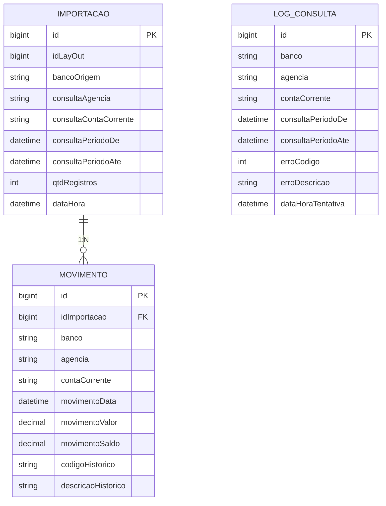

# API BB Extrato - Modelo de Dados e Esquema de Banco

## 📋 Visão Geral

O sistema API BB Extrato utiliza **Microsoft SQL Server** como banco de dados principal, organizando os dados em múltiplos catálogos e esquemas para separar responsabilidades funcionais. A estrutura segue princípios de normalização e auditoria completa.

## 🗄️ Estrutura de Catálogos e Esquemas

### 📊 Catalogo `COPPETEC`
**Função**: Dados operacionais do sistema de reconciliação bancária

#### Schema `conciliacaoBancaria`
- **Função**: Armazena dados de importação e movimentações bancárias
- **Tabelas**: `importacao`, `movimento`

#### Schema `bancoDoBrasil`
- **Função**: Configurações e consultas específicas do Banco do Brasil
- **Função**: `getContaAConsultar()` - Retorna contas ativas para consulta

### 📋 Catalogo `COPPETEC_LOG`
**Função**: Sistema de auditoria e logs de operações

#### Schema `bancoDoBrasil`
- **Função**: Logs específicos de operações com o Banco do Brasil
- **Tabelas**: `consultaContaCorrenteExtrato_log`

## 📄 Detalhamento das Entidades

### 🏦 Entidade: `BankReconciliationImportEntity`

**Tabela**: `COPPETEC.conciliacaoBancaria.importacao`
**Função**: Registra cada operação de importação de extrato bancário

```sql
CREATE TABLE [COPPETEC].[conciliacaoBancaria].[importacao] (
    id                          BIGINT IDENTITY(1,1) PRIMARY KEY,
    idLayOut                    BIGINT,
    idDocumento                 BIGINT,
    bancoOrigem                 VARCHAR(255),
    arquivoNome                 VARCHAR(255),
    arquivoGeracaoDataHora      DATETIME2,
    arquivoNumeroSequencial     BIGINT,
    arquivoNumeroVersaoLayOut   VARCHAR(255),
    qtdLotes                    INT,
    qtdRegistros                INT,
    qtdContas                   INT,
    dataHora                    DATETIME2,
    idUsuario                   BIGINT,
    consultaAgencia             VARCHAR(255),
    consultaContaCorrente       VARCHAR(255),
    consultaPeriodoDe           DATETIME2,
    consultaPeriodoAte          DATETIME2
);
```

#### 📋 Campos Principais

| Campo | Tipo | Descrição |
|-------|------|-----------|
| `id` | `BIGINT IDENTITY` | Chave primária auto-incremento |
| `idLayOut` | `BIGINT` | Identificador do layout de arquivo |
| `idDocumento` | `BIGINT` | Identificador do documento de origem |
| `bancoOrigem` | `VARCHAR(255)` | Código do banco de origem |
| `arquivoNome` | `VARCHAR(255)` | Nome do arquivo de extrato |
| `arquivoGeracaoDataHora` | `DATETIME2` | Data/hora de geração do arquivo |
| `qtdLotes` | `INT` | Quantidade de lotes processados |
| `qtdRegistros` | `INT` | Quantidade de registros importados |
| `qtdContas` | `INT` | Quantidade de contas processadas |
| `consultaAgencia` | `VARCHAR(255)` | Agência consultada |
| `consultaContaCorrente` | `VARCHAR(255)` | Conta corrente consultada |
| `consultaPeriodoDe` | `DATETIME2` | Data início da consulta |
| `consultaPeriodoAte` | `DATETIME2` | Data fim da consulta |

#### 🔄 Relacionamentos
- **1:N** com `BankReconciliationMovementEntity` via `idImportacao`

### 💰 Entidade: `BankReconciliationMovementEntity`

**Tabela**: `COPPETEC.conciliacaoBancaria.movimento`
**Função**: Armazena cada movimentação bancária individual do extrato

```sql
CREATE TABLE [COPPETEC].[conciliacaoBancaria].[movimento] (
    id                                    BIGINT IDENTITY(1,1) PRIMARY KEY,
    idImportacao                          BIGINT,
    numeroSequencialExtrato               BIGINT,
    numeroSequencialNoArquivo             BIGINT,
    numeroSequencialNoLote                INT,
    banco                                 VARCHAR(255),
    agencia                               VARCHAR(255),
    agenciaDV                             VARCHAR(255),
    contaCorrente                         VARCHAR(255),
    contaCorrenteDV                       VARCHAR(255),
    contaCorrenteSIC                      VARCHAR(255),
    contaCorrenteDescricao                VARCHAR(255),
    movimentoData                         DATETIME2,
    movimentoDataContabil                 DATETIME2,
    movimentoTipo                         VARCHAR(255),
    movimentoValor                        DECIMAL(19,2),
    movimentoSaldo                        DECIMAL(19,2),
    posicaoSaldo                          VARCHAR(1),
    natureza                              VARCHAR(3),
    complementoTipo                       VARCHAR(2),
    complementoBancoOrigem                VARCHAR(3),
    complementoAgenciaOrigem              VARCHAR(5),
    complementoContaCorrenteOrigem        VARCHAR(20),
    complementoContaCorrenteDVOrigem      VARCHAR(1),
    complementoAlfa                       VARCHAR(12),
    isencaoCPMF                          VARCHAR(1),
    movimentoCategoria                    VARCHAR(3),
    codigoHistorico                       VARCHAR(4),
    descricaoHistorico                    VARCHAR(255),
    documentoNumero                       VARCHAR(39),
    somatorioValoresADebito              DECIMAL(19,2),
    somatorioValoresACredito             DECIMAL(19,2),
    numeroLancamentos                     INT,
    numeroCpfCnpjContrapartida           VARCHAR(18),
    indicadorTipoPessoaContrapartida     VARCHAR(1),
    
    FOREIGN KEY (idImportacao) REFERENCES [importacao](id)
);
```

#### 📋 Campos Principais

**Identificação da Conta:**
| Campo | Tipo | Descrição |
|-------|------|-----------|
| `idImportacao` | `BIGINT` | FK para tabela de importação |
| `banco` | `VARCHAR(255)` | Código do banco |
| `agencia` | `VARCHAR(255)` | Número da agência |
| `agenciaDV` | `VARCHAR(255)` | Dígito verificador da agência |
| `contaCorrente` | `VARCHAR(255)` | Número da conta corrente |
| `contaCorrenteDV` | `VARCHAR(255)` | Dígito verificador da conta |

**Dados da Movimentação:**
| Campo | Tipo | Descrição |
|-------|------|-----------|
| `movimentoData` | `DATETIME2` | Data da movimentação |
| `movimentoDataContabil` | `DATETIME2` | Data contábil |
| `movimentoTipo` | `VARCHAR(255)` | Tipo de movimentação |
| `movimentoValor` | `DECIMAL(19,2)` | Valor da movimentação |
| `movimentoSaldo` | `DECIMAL(19,2)` | Saldo após movimentação |
| `posicaoSaldo` | `VARCHAR(1)` | Posição do saldo (D/C) |

**Informações Complementares:**
| Campo | Tipo | Descrição |
|-------|------|-----------|
| `codigoHistorico` | `VARCHAR(4)` | Código do histórico bancário |
| `descricaoHistorico` | `VARCHAR(255)` | Descrição do histórico |
| `documentoNumero` | `VARCHAR(39)` | Número do documento |
| `numeroCpfCnpjContrapartida` | `VARCHAR(18)` | CPF/CNPJ da contrapartida |
| `indicadorTipoPessoaContrapartida` | `VARCHAR(1)` | Tipo pessoa contrapartida (F/J) |

#### 🔄 Relacionamentos
- **N:1** com `BankReconciliationImportEntity` via `idImportacao`

### 📊 Entidade: `ConsultaContaCorrenteExtratoLogEntity`

**Tabela**: `COPPETEC_LOG.bancoDoBrasil.consultaContaCorrenteExtrato_log`
**Função**: Log de auditoria de todas as tentativas de consulta de extrato

```sql
CREATE TABLE [COPPETEC_LOG].[bancoDoBrasil].[consultaContaCorrenteExtrato_log] (
    id                      BIGINT IDENTITY(1,1) PRIMARY KEY,
    banco                   VARCHAR(3) NOT NULL,
    agencia                 VARCHAR(5) NOT NULL,
    contaCorrente           VARCHAR(20) NOT NULL,
    consultaPeriodoDe       DATETIME2 NOT NULL,
    consultaPeriodoAte      DATETIME2 NOT NULL,
    erroCodigo              INT NOT NULL,
    erroDescricao           VARCHAR(1024),
    dataHoraTentativa       DATETIME2 NOT NULL,
    dataHora                DATETIME2 NOT NULL
);
```

#### 📋 Campos Principais

| Campo | Tipo | Descrição |
|-------|------|-----------|
| `id` | `BIGINT IDENTITY` | Chave primária auto-incremento |
| `banco` | `VARCHAR(3)` | Código do banco (ex: "001") |
| `agencia` | `VARCHAR(5)` | Código da agência |
| `contaCorrente` | `VARCHAR(20)` | Número da conta corrente |
| `consultaPeriodoDe` | `DATETIME2` | Data início da consulta |
| `consultaPeriodoAte` | `DATETIME2` | Data fim da consulta |
| `erroCodigo` | `INT` | Código de erro (0 = sucesso) |
| `erroDescricao` | `VARCHAR(1024)` | Descrição detalhada do erro |
| `dataHoraTentativa` | `DATETIME2` | Data/hora da tentativa |
| `dataHora` | `DATETIME2` | Data/hora do log |

#### 📈 Códigos de Erro Comuns

| Código | Descrição |
|--------|-----------|
| `0` | Sucesso |
| `404` | Conta não possui lançamentos |
| `500` | Erro interno do servidor BB |
| `401` | Erro de autenticação |
| `429` | Rate limit excedido |

## 🔍 Stored Procedures e Funções

### 📋 Função: `getContaAConsultar()`

**Schema**: `COPPETEC.bancoDoBrasil`
**Função**: Retorna lista de contas ativas para consulta automática

```sql
-- Utilizada pelo ActiveBankAccountsRepositoryImpl
SELECT * FROM [COPPETEC].[bancoDoBrasil].[getContaAConsultar]()
```

**Retorno**: Lista de contas com estrutura compatível com `Account.kt`
- `banco`: Código do banco
- `agencia`: Número da agência  
- `agenciaSemDV`: Agência sem dígito verificador
- `contaCorrente`: Número da conta
- `contaCorrenteSemDV`: Conta sem dígito verificador
- `consultaPeriodoDe`: Data início período consulta
- `consultaPeriodoAte`: Data fim período consulta

## 📊 Relacionamentos e Integridade

### 🔗 Diagrama de Relacionamentos



### 🎯 Regras de Integridade

#### Integridade Referencial
- `movimento.idImportacao` → `importacao.id` (FK)
- Cascade delete: Remoção de importação remove movimentações

#### Regras de Negócio no Banco
- `importacao.qtdRegistros` deve corresponder ao número de registros em `movimento`
- `log_consulta.erroCodigo = 0` indica sucesso
- Datas de consulta (`consultaPeriodoDe` ≤ `consultaPeriodoAte`)

## ⚙️ Configuração de Conexão

### 🔧 Configuração Spring Data JPA

```yaml
# application.yaml
spring:
  datasource:
    hikari:
      minimum-idle: 1
      maximum-pool-size: 1
  jpa:
    database-platform: org.hibernate.dialect.SQLServerDialect
    hibernate:
      ddl-auto: none  # Esquema gerenciado externamente
```

### 📋 Configuração de Pool de Conexões

- **Pool Mínimo**: 1 conexão
- **Pool Máximo**: 1 conexão
- **Justificativa**: Sistema batch com baixa concorrência

## 🔐 Considerações de Segurança

### 🛡️ Segurança de Dados
- **Separação de Catálogos**: Dados operacionais vs logs
- **Auditoria Completa**: Todo acesso registrado em logs
- **Transações ACID**: Garantia de consistência

### 🔒 Controle de Acesso
- **Usuário de Aplicação**: Acesso limitado aos schemas necessários
- **Funções Específicas**: `getContaAConsultar()` encapsula lógica de negócio
- **Logs Isolados**: Catálogo separado para auditoria

## 📈 Performance e Otimização

### 🚀 Índices Recomendados

```sql
-- Índice para consultas por período na tabela de movimento
CREATE INDEX IX_movimento_data_agencia_conta 
ON [movimento] (movimentoData, agencia, contaCorrente);

-- Índice para logs por conta e período
CREATE INDEX IX_log_agencia_conta_periodo 
ON [consultaContaCorrenteExtrato_log] (agencia, contaCorrente, consultaPeriodoDe);

-- Índice para importações por data
CREATE INDEX IX_importacao_dataHora 
ON [importacao] (dataHora DESC);
```

### 📊 Estratégias de Manutenção
- **Particionamento**: Por data nas tabelas de log
- **Arquivamento**: Dados antigos movidos para storage de longo prazo
- **Limpeza Automática**: Logs com mais de X meses removidos

## 🎯 Mapeamento Entidade-Tabela

| Entidade JPA | Tabela Física | Schema | Função |
|--------------|---------------|--------|---------|
| `BankReconciliationImportEntity` | `importacao` | `COPPETEC.conciliacaoBancaria` | Metadados de importação |
| `BankReconciliationMovementEntity` | `movimento` | `COPPETEC.conciliacaoBancaria` | Movimentações bancárias |
| `ConsultaContaCorrenteExtratoLogEntity` | `consultaContaCorrenteExtrato_log` | `COPPETEC_LOG.bancoDoBrasil` | Auditoria de consultas |

---
*Documentação gerada como parte da análise do modelo de dados do sistema API BB Extrato - UFRJ/Coppetec*
