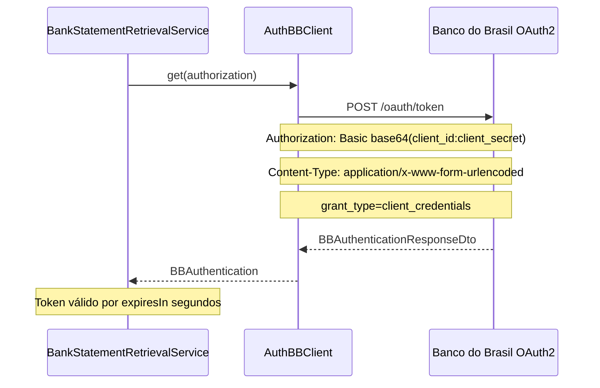
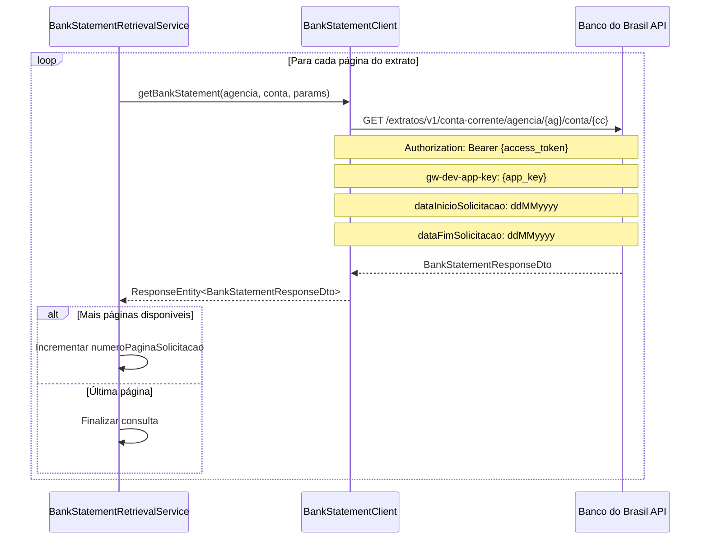
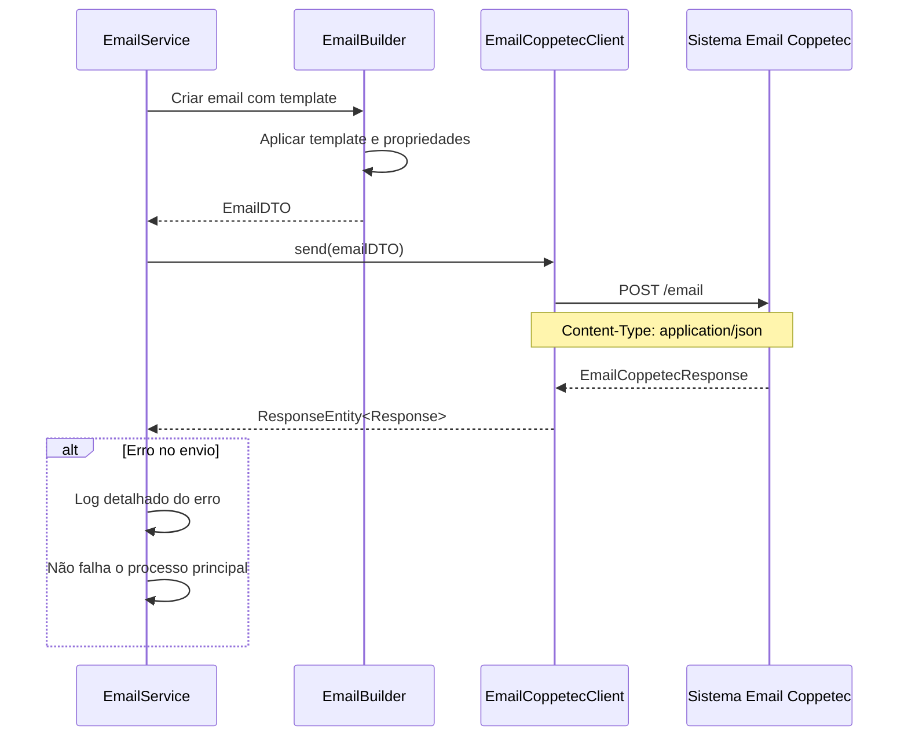

# API BB Extrato - Guia de Integrações Externas

## 📋 Visão Geral

O sistema API BB Extrato integra-se com **duas APIs externas principais**: a API oficial do **Banco do Brasil** para consulta de extratos bancários e o **Sistema de Email Coppetec** para notificações. Todas as integrações utilizam **Spring Cloud OpenFeign** como cliente HTTP declarativo.

## 🏦 Integração com API do Banco do Brasil

### 🔐 Autenticação OAuth2

#### Endpoint de Autenticação
**Cliente**: `AuthBBClient.kt`
**URL**: Configurável via `${bb.endpoints.auth}`
**Método**: `POST`
**Protocolo**: OAuth2 Client Credentials

```kotlin
@FeignClient(
    value = "auth-bb",
    url = "\${bb.endpoints.auth}"
)
interface AuthBBClient {
    @PostMapping
    fun get(
        @RequestHeader("Authorization") authorization: String,
        @RequestHeader("Content-Type") contentType: String = "application/x-www-form-urlencoded"
    ): BBAuthenticationResponseDto
}
```

#### 📋 Fluxo de Autenticação



#### 📄 Request/Response de Autenticação

**Request Headers:**
```http
Authorization: Basic base64(client_id:client_secret)
Content-Type: application/x-www-form-urlencoded
```

**Request Body:**
```
grant_type=client_credentials&scope=extrato
```

**Response:**
```json
{
    "access_token": "eyJhbGciOiJSUzI1NiIsInR5cCI6IkpXVCJ9...",
    "token_type": "Bearer",
    "expires_in": 3600,
    "creationDate": "2024-01-15T10:30:00"
}
```

### 💰 Consulta de Extratos Bancários

#### Endpoint de Consulta
**Cliente**: `BankStatementClient.kt`
**URL**: Configurável via `${bb.endpoints.bank-statement}`
**Método**: `GET`
**Autenticação**: Bearer Token (OAuth2)

```kotlin
@FeignClient(
    value = "bank-statement",
    url = "\${bb.endpoints.bank-statement}",
    configuration = [FeignConfig::class]
)
interface BankStatementClient {
    @GetMapping("/extratos/v1/conta-corrente/agencia/{agencia}/conta/{conta}")
    fun getBankStatement(
        @PathVariable agencia: String,
        @PathVariable conta: String,
        @RequestParam("gw-dev-app-key") appKey: String,
        @RequestParam("numeroPaginaSolicitacao", required = false) numeroPaginaSolicitacao: String?,
        @RequestParam("dataInicioSolicitacao", required = true) dataInicioSolicitacao: String,
        @RequestParam("dataFimSolicitacao", required = true) dataFimSolicitacao: String,
        @RequestHeader("Authorization") authorization: String,
        @RequestHeader("Content-Type") contentType: String = "application/json"
    ): ResponseEntity<BankStatementResponseDto>
}
```

#### 📋 Fluxo de Consulta de Extrato



#### 📄 Parâmetros da Consulta

| Parâmetro | Tipo | Obrigatório | Descrição |
|-----------|------|-------------|-----------|
| `agencia` | `String` | Sim | Número da agência (path param) |
| `conta` | `String` | Sim | Número da conta corrente (path param) |
| `gw-dev-app-key` | `String` | Sim | Chave da aplicação no gateway BB |
| `dataInicioSolicitacao` | `String` | Sim | Data início período (formato: ddMMyyyy) |
| `dataFimSolicitacao` | `String` | Sim | Data fim período (formato: ddMMyyyy) |
| `numeroPaginaSolicitacao` | `String` | Não | Número da página (para paginação) |

#### 📊 Response - Estrutura do Extrato

```json
{
    "numeroPaginaAtual": 1,
    "quantidadeRegistroPaginaAtual": 50,
    "numeroPaginaAnterior": 0,
    "numeroPaginaProximo": 2,
    "quantidadeTotalPagina": 3,
    "quantidadeTotalRegistro": 150,
    "listaLancamento": [
        {
            "indicadorTipoLancamento": "C",
            "dataLancamento": 20240115,
            "dataMovimento": 20240115,
            "codigoAgenciaOrigem": 1234,
            "numeroLote": 1,
            "numeroDocumento": 123456789,
            "codigoHistorico": 101,
            "textoDescricaoHistorico": "TRANSFERENCIA DOC",
            "valorLancamento": 1500.50,
            "indicadorSinalLancamento": "+",
            "textoInformacaoComplementar": "Complemento",
            "numeroCpfCnpjContrapartida": 12345678901,
            "indicadorTipoPessoaContrapartida": "F",
            "codigoBancoContrapartida": 341,
            "codigoAgenciaContrapartida": 5678,
            "numeroContaContrapartida": "987654321",
            "textoDvContaContrapartida": "0"
        }
    ]
}
```

### 🛡️ Tratamento de Erros BB

#### Códigos de Erro Comuns

| Status | Código | Descrição | Ação do Sistema |
|--------|--------|-----------|-----------------|
| `200` | - | Sucesso | Processa normalmente |
| `401` | `UNAUTHORIZED` | Token inválido/expirado | Renova autenticação |
| `404` | `NOT_FOUND` | Conta sem lançamentos | Envia email de notificação |
| `500` | `INTERNAL_ERROR` | Erro interno BB | Aplica retry pattern |
| `429` | `RATE_LIMIT` | Limite de requests | Aguarda e tenta novamente |

#### Implementação de Retry Pattern

```kotlin
// Configuração via Resilience4j
@Retryable(
    value = [FeignException::class],
    maxAttempts = 3,
    backoff = Backoff(delay = 2000, multiplier = 2.0)
)
fun consultBankStatement(request: BankStatementRequest): BankStatementResponseDto
```

## 📧 Integração com Sistema de Email Coppetec

### 📨 Endpoint de Envio
**Cliente**: `EmailCoppetecClient.kt`
**URL**: Configurável via `${email.service.url}`
**Método**: `POST /email`
**Autenticação**: Não especificada (possivelmente IP whitelist)

```kotlin
@FeignClient(
    url = "\${email.service.url}",
    name = "\${email.service.name}"
)
interface EmailCoppetecClient {
    @RequestMapping(
        method = [POST],
        value = ["/email"],
        consumes = ["application/json"],
        produces = ["application/json"]
    )
    fun send(@RequestBody email: EmailDTO): ResponseEntity<EmailCoppetecResponse>
}
```

### 📋 Fluxo de Envio de Email



### 📄 Estrutura do Email

#### EmailDTO Structure
```json
{
    "id": 0,
    "origem": "API-EXTRATO",
    "assunto": "SISTEMA DE EXTRATO - ERRO",
    "recipiente": "sistemas@coppetec.ufrj.br",
    "text": "SISTEMA DE EXTRATO - ERRO",
    "template": "template_erro_extrato",
    "reply": "csantos@coppetec.ufrj.br",
    "propriedades": [
        {
            "chave": "msg",
            "valor": "Mensagem de erro detalhada"
        },
        {
            "chave": "error",
            "valor": "Stack trace da exceção"
        }
    ]
}
```

#### Templates de Email Disponíveis

| Template | Uso | Propriedades |
|----------|-----|--------------|
| `template_erro_extrato` | Erros gerais | `msg`, `error` |
| `template_conta_nao_encontrada` | Conta sem lançamentos | `agencia`, `conta`, `periodo` |
| `template_limite_retry` | Limite de tentativas | `agencia`, `conta`, `tentativas` |

### 📧 Tipos de Notificação

#### 1. Erro de Conta Não Encontrada (404)
```kotlin
val message = EmailConstants.NOT_FOUND_MESSAGE.format(
    account.branch, 
    account.currentAccount, 
    "Conta não possui lançamentos",
    exception.message
)
```

#### 2. Erro Interno do Servidor (500)
```kotlin
val message = EmailConstants.INTERNAL_SERVER_ERROR_MESSAGE.format(
    account.branch,
    account.currentAccount,
    "Erro interno no banco",
    exception.message
)
```

#### 3. Erro Genérico
```kotlin
val message = EmailConstants.GENERIC_ERROR_MESSAGE.format(
    account.branch,
    account.currentAccount,
    exception.message,
    exception.stackTrace
)
```

#### 4. Limite de Retry Excedido
```kotlin
val message = EmailConstants.RETRY_LIMIT_EXCEEDED_MESSAGE.format(
    account.currentAccount,
    account.branch,
    exception.message
)
```

## ⚙️ Configurações de Integração

### 🔧 Configuração Feign SSL

#### Para Ambiente de Desenvolvimento
```kotlin
@Configuration
class FeignClientSSLBypassConfig {
    @Bean
    fun feignClientBuilder(): Feign.Builder {
        return Feign.builder()
            .client(OkHttpClient.Builder()
                .sslSocketFactory(trustAllCerts, trustAllCertsManager)
                .hostnameVerifier { _, _ -> true }
                .build())
    }
}
```

#### Para Ambiente de Produção
```kotlin
@Configuration  
class FeignSSLConfig {
    @Bean
    fun feignClientBuilder(): Feign.Builder {
        return Feign.builder()
            .client(OkHttpClient.Builder()
                .sslSocketFactory(sslContext.socketFactory, trustManager)
                .hostnameVerifier(DefaultHostnameVerifier())
                .build())
    }
}
```

### 📋 Configuração de Timeouts

```yaml
# application.yaml
feign:
  client:
    config:
      default:
        connectTimeout: 10000
        readTimeout: 30000
      auth-bb:
        connectTimeout: 5000
        readTimeout: 10000
      bank-statement:
        connectTimeout: 15000
        readTimeout: 60000
```

### 🛡️ Configuração de Retry

```yaml
# application.yaml
resilience4j:
  retry:
    instances:
      bb-api:
        maxAttempts: 3
        waitDuration: 2s
        exponentialBackoffMultiplier: 2
        retryExceptions:
          - feign.FeignException$InternalServerError
          - feign.FeignException$BadGateway
          - feign.FeignException$ServiceUnavailable
```

## 📊 Monitoramento e Observabilidade

### 📈 Métricas de Integração

#### Métricas do Banco do Brasil
- **Taxa de Sucesso**: Percentual de requests bem-sucedidos
- **Tempo de Response**: Latência média das consultas
- **Tokens Renovados**: Frequência de renovação de autenticação
- **Errors por Status**: Distribuição de códigos de erro

#### Métricas do Sistema de Email
- **Emails Enviados**: Contagem total de notificações
- **Taxa de Erro**: Percentual de falhas no envio
- **Tipos de Template**: Distribuição por tipo de erro

### 🔍 Logs de Auditoria

#### Estrutura de Log BB
```kotlin
logger.info { "Iniciando consulta de extrato para agência ${dto.agency} e conta ${dto.account}" }
logger.info { "Token de acesso obtido com sucesso" }
logger.info { "Consultando página $currentPage do extrato" }
logger.error { "Erro na consulta BB: ${exception.message}" }
```

#### Estrutura de Log Email
```kotlin
logger.info { "Enviando e-mail de erro para informar o erro: $error" }
logger.error { "Erro ao enviar e-mail: ${ex.message}" }
logger.error { "Erro ao enviar e-mail: ${ex.cause}" }
```

## 🔐 Segurança das Integrações

### 🛡️ Banco do Brasil
- **OAuth2 Client Credentials**: Autenticação via certificado digital
- **HTTPS Obrigatório**: Todas as comunicações criptografadas
- **Certificate Pinning**: Validação de certificados do BB
- **Rate Limiting**: Respeito aos limites de API

### 📧 Sistema Coppetec
- **IP Whitelisting**: Acesso restrito por IP
- **HTTPS**: Comunicação segura
- **Templates Controlados**: Uso de templates pré-definidos
- **Não exposição de dados sensíveis**: Apenas códigos de conta em emails

## 🎯 Resumo das Integrações

| Integração | Protocolo | Autenticação | Retry | Timeout | Finalidade |
|------------|-----------|--------------|-------|---------|------------|
| **Banco do Brasil** | HTTPS/REST | OAuth2 Client Credentials | Sim (3x) | 60s | Consulta extratos |
| **Email Coppetec** | HTTPS/REST | IP Whitelist | Não | 30s | Notificações de erro |

---
*Documentação gerada como parte da análise de integrações externas do sistema API BB Extrato - UFRJ/Coppetec*
