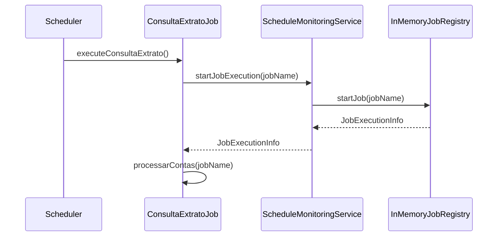
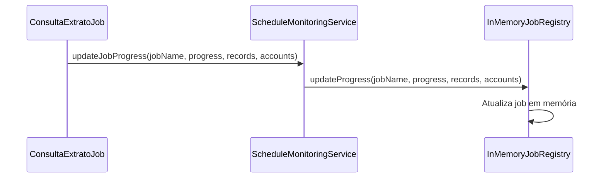
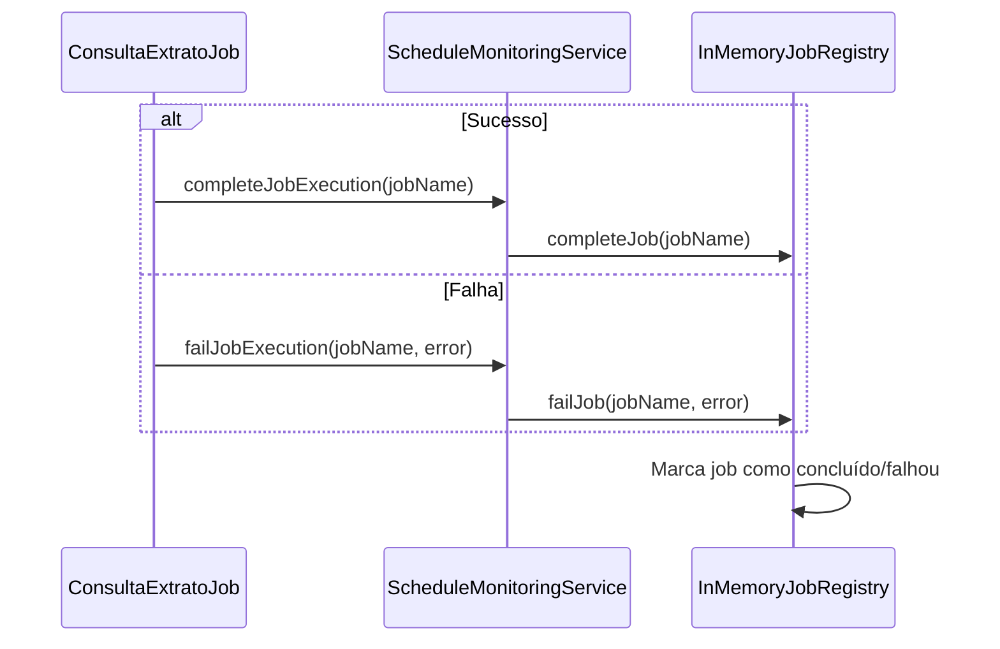

# Monitoramento de Schedule - Documentação

## Resumo/Objetivo
Sistema de monitoramento em tempo real para jobs agendados de processamento de extratos bancários, sem persistência no banco de dados. Permite acompanhar o progresso, status e métricas de execução dos jobs em memória.

## Contexto
A funcionalidade foi implementada para permitir que usuários monitorem em tempo real o status dos jobs agendados (`ConsultaExtratoJob`), incluindo progresso, histórico de execuções e alertas de falhas, sem criar novas tabelas no banco de dados.

## Arquitetura da Solução

### Componentes Implementados

#### 1. **JobExecutionStatus (Enum)**
- **Localização**: `src/main/kotlin/.../domain/JobExecutionStatus.kt`
- **Responsabilidade**: Controle de estado das execuções
- **Valores**: `STARTING`, `RUNNING`, `COMPLETED`, `FAILED`, `CANCELLED`

#### 2. **DTOs de Resposta**
- **JobProgressResponse**: Status atual dos jobs em execução
- **JobProgressSummaryResponse**: Métricas agregadas em tempo real
- **JobExecutionInfo**: Informações básicas da execução atual

#### 3. **InMemoryJobRegistry**
- **Localização**: `src/main/kotlin/.../application/service/InMemoryJobRegistry.kt`
- **Responsabilidade**: Armazenamento temporário em memória dos jobs ativos
- **Funcionalidades**:
  - `ConcurrentHashMap` para armazenar jobs em execução
  - Limpeza automática de jobs concluídos (a cada 5 minutos)
  - Limpeza de jobs órfãos (a cada hora)
  - Thread-safe para múltiplas execuções simultâneas

#### 4. **ScheduleMonitoringService**
- **Localização**: `src/main/kotlin/.../application/service/ScheduleMonitoringService.kt`
- **Responsabilidade**: Lógica de negócio para monitoramento em tempo real
- **Métodos principais**:
  - `getCurrentProgress()`: Status atual dos jobs em execução
  - `getActiveJobs()`: Lista de jobs ativos
  - `getJobStatus(jobName: String)`: Status de um job específico
  - `startJobExecution(jobName: String)`: Iniciar rastreamento
  - `updateJobProgress(jobName: String, progress: Int)`: Atualizar progresso
  - `completeJobExecution(jobName: String)`: Marcar como concluído
  - `failJobExecution(jobName: String, error: String)`: Marcar como falhou

#### 5. **ScheduleController**
- **Localização**: `src/main/kotlin/.../infra/adapter/controller/ScheduleController.kt`
- **Responsabilidade**: Endpoints REST para monitoramento em tempo real
- **Endpoints**:
  - `GET /api/schedule/progress` - Status atual dos jobs em execução
  - `GET /api/schedule/active` - Lista de jobs ativos
  - `GET /api/schedule/job/{jobName}` - Status de um job específico
  - `GET /api/schedule/stats` - Estatísticas resumidas do sistema
  - `POST /api/schedule/job/{jobName}/cancel` - Cancelar um job
  - `GET /api/schedule/health` - Health check do sistema

#### 6. **Integração com ConsultaExtratoJob**
- **Modificação**: `src/main/kotlin/.../infra/job/ConsultaExtratoJob.kt`
- **Responsabilidade**: Capturar eventos de execução
- **Pontos de integração**:
  - Início da execução: `startJobExecution()`
  - Atualização de progresso: `updateJobProgress()`
  - Conclusão: `completeJobExecution()`
  - Falha: `failJobExecution()`

## Endpoints da API

### 1. **GET /api/schedule/progress**
Consulta o progresso atual de todos os jobs agendados.

**Resposta de Sucesso (200):**
```json
{
  "activeJobs": 2,
  "completedJobs": 15,
  "failedJobs": 1,
  "cancelledJobs": 0,
  "averageExecutionTime": 45000,
  "successRate": 0.9375,
  "totalRecordsProcessed": 1250,
  "totalAccountsProcessed": 8,
  "activeJobsList": [...]
}
```

### 2. **GET /api/schedule/active**
Lista todos os jobs atualmente em execução.

**Resposta de Sucesso (200):**
```json
[
  {
    "jobName": "consulta-extrato-1234567890",
    "status": "RUNNING",
    "statusDescription": "Executando",
    "startTime": "2024-01-15T14:30:00",
    "progressPercentage": 75,
    "recordsProcessed": 1250,
    "accountsProcessed": 8,
    "lastUpdated": "2024-01-15T14:35:00"
  }
]
```

### 3. **GET /api/schedule/job/{jobName}**
Consulta o status de um job específico.

**Parâmetros de Path:**
- `jobName` (string, obrigatório): Nome do job

**Resposta de Sucesso (200):**
```json
{
  "jobName": "consulta-extrato-1234567890",
  "status": "RUNNING",
  "statusDescription": "Executando",
  "startTime": "2024-01-15T14:30:00",
  "progressPercentage": 75,
  "recordsProcessed": 1250,
  "accountsProcessed": 8,
  "lastUpdated": "2024-01-15T14:35:00"
}
```

### 4. **GET /api/schedule/stats**
Obtém estatísticas resumidas do sistema de monitoramento.

**Resposta de Sucesso (200):**
```json
{
  "totalJobs": 18,
  "runningJobs": 2,
  "completedJobs": 15,
  "failedJobs": 1,
  "cancelledJobs": 0,
  "totalRecordsProcessed": 1250,
  "totalAccountsProcessed": 8
}
```

### 5. **POST /api/schedule/job/{jobName}/cancel**
Cancela um job em execução.

**Parâmetros de Path:**
- `jobName` (string, obrigatório): Nome do job

**Resposta de Sucesso (200):** Job cancelado com sucesso

### 6. **GET /api/schedule/health**
Health check do sistema de monitoramento.

**Resposta de Sucesso (200):**
```json
{
  "status": "HEALTHY",
  "timestamp": "2024-01-15T14:35:00",
  "activeJobs": 2,
  "totalJobs": 18
}
```

## Fluxo de Funcionamento

### 1. **Início de Execução**


### 2. **Atualização de Progresso**


### 3. **Conclusão ou Falha**


## Características Técnicas

### **Armazenamento em Memória**
- **Tipo**: `ConcurrentHashMap<String, JobExecutionInfo>`
- **Thread-safe**: Sim, para múltiplas execuções simultâneas
- **Limpeza automática**: Jobs concluídos são removidos automaticamente
- **Timeout**: Jobs órfãos (mais de 24h) são limpos automaticamente

### **Atualizações em Tempo Real**
- **Frequência**: A cada processamento de conta individual
- **Granularidade**: Progresso por conta processada
- **Métricas**: Registros processados, contas processadas, tempo estimado

### **Métricas e Alertas**
- **Métricas**: Tempo de execução atual, progresso em tempo real, status atual
- **Alertas**: Falhas durante execução, tempo de execução excessivo
- **Notificações**: Logs estruturados para monitoramento

## Testes Implementados

### **Testes Unitários**
- **ScheduleMonitoringServiceTest**: Validação da lógica de monitoramento
- **ScheduleControllerTest**: Validação dos endpoints REST

### **Cobertura de Testes**
- ✅ Início de execução de job
- ✅ Atualização de progresso
- ✅ Conclusão de job
- ✅ Falha de job
- ✅ Cancelamento de job
- ✅ Consulta de status
- ✅ Estatísticas do sistema
- ✅ Health check

## Como Usar

### **1. Monitorar Progresso Atual**
```bash
curl -X GET "http://localhost:8080/api/schedule/progress"
```

### **2. Listar Jobs Ativos**
```bash
curl -X GET "http://localhost:8080/api/schedule/active"
```

### **3. Consultar Status de Job Específico**
```bash
curl -X GET "http://localhost:8080/api/schedule/job/consulta-extrato-1234567890"
```

### **4. Ver Estatísticas do Sistema**
```bash
curl -X GET "http://localhost:8080/api/schedule/stats"
```

### **5. Health Check**
```bash
curl -X GET "http://localhost:8080/api/schedule/health"
```

## Monitoramento e Observabilidade

### **Logs Estruturados**
- **Nível INFO**: Início, conclusão e cancelamento de jobs
- **Nível DEBUG**: Atualizações de progresso
- **Nível WARN**: Jobs não encontrados
- **Nível ERROR**: Falhas durante execução

### **Métricas Disponíveis**
- Total de jobs ativos
- Total de jobs concluídos
- Total de jobs falhados
- Tempo médio de execução
- Taxa de sucesso
- Total de registros processados
- Total de contas processadas

### **Alertas Automáticos**
- Limpeza automática de jobs concluídos
- Limpeza de jobs órfãos
- Logs de auditoria para todas as operações

## Limitações e Considerações

### **Limitações Atuais**
- **Sem persistência**: Dados são perdidos após reinicialização da aplicação
- **Memória limitada**: Jobs antigos são limpos automaticamente
- **Sem histórico**: Apenas jobs ativos são mantidos em memória

### **Considerações de Uso**
- **Monitoramento em tempo real**: Ideal para acompanhamento durante execução
- **Não para auditoria**: Dados não são persistidos para análise histórica
- **Escalabilidade**: Funciona bem para poucos jobs simultâneos

## Próximos Passos Sugeridos

### **Melhorias Futuras**
1. **Persistência opcional**: Configuração para salvar métricas em banco
2. **WebSocket**: Atualizações em tempo real para frontend
3. **Métricas avançadas**: Percentis de tempo de execução, tendências
4. **Alertas configuráveis**: Notificações por email/Slack para falhas
5. **Dashboard**: Interface web para visualização das métricas

### **Integrações**
1. **Prometheus**: Métricas para monitoramento de infraestrutura
2. **Grafana**: Dashboards visuais para análise
3. **ELK Stack**: Centralização de logs e análise

## Conclusão

A funcionalidade de monitoramento de schedule foi implementada com sucesso, fornecendo:

- ✅ **Monitoramento em tempo real** sem persistência no banco
- ✅ **Métricas detalhadas** de execução dos jobs
- ✅ **API REST completa** para consulta de status
- ✅ **Integração transparente** com o ConsultaExtratoJob existente
- ✅ **Testes abrangentes** para validação da funcionalidade
- ✅ **Documentação completa** para uso e manutenção

O sistema está pronto para uso em produção e pode ser facilmente estendido com funcionalidades adicionais conforme necessário.
